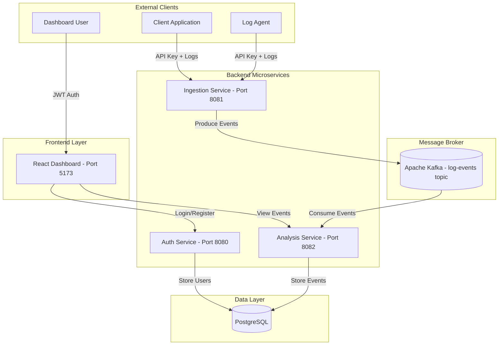
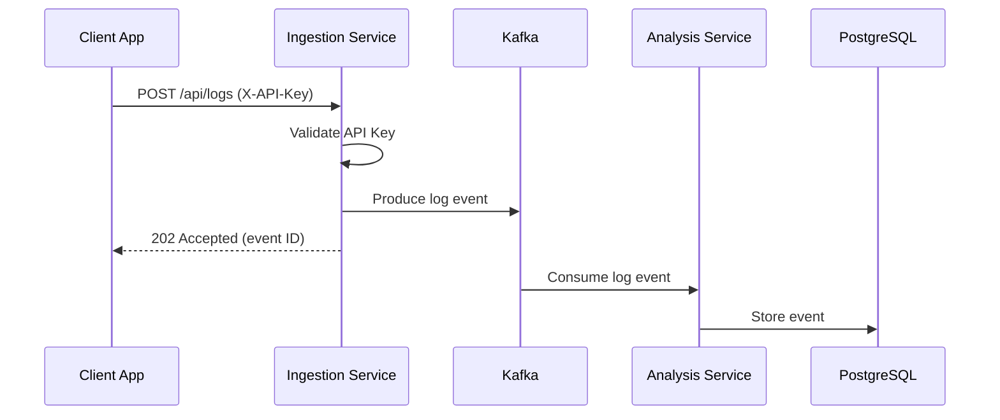

# LogAnomaly Detection Platform

Real-time log monitoring and anomaly detection platform built with Event-Driven Microservices.

## Tech Stack

| Layer | Technology |
|-------|------------|
| Backend | Java 17, Spring Boot 3, Gradle |
| Frontend | React, TypeScript, Vite |
| Database | PostgreSQL 14 |
| Messaging | Apache Kafka |
| Infrastructure | Docker, Docker Compose |

## Architecture



## Data Flow



## Services

| Service | Purpose | Port |
|---------|---------|------|
| auth-service | User registration, login, JWT | 8080 |
| ingestion-service | Receives logs, publishes to Kafka | 8081 |
| analysis-service | Consumes from Kafka, stores in DB | 8082 |
| frontend-ui | React dashboard | 5173 |
| postgres-db | PostgreSQL database | 5432 |
| kafka | Message broker | 9092 |

## Quick Start

```bash
# Start everything
docker-compose up --build -d

# View logs
docker-compose logs -f

# Stop and clean
docker-compose down -v
```

## API Usage

### Send Logs (Ingestion Service)

```bash
# Single log
curl -X POST http://localhost:8081/api/logs \
  -H "Content-Type: application/json" \
  -H "X-API-Key: your-api-key-here-change-in-production" \
  -d '{
    "level": "INFO",
    "message": "User login successful",
    "service": "auth-service",
    "metadata": {"userId": "123"}
  }'

# Batch logs
curl -X POST http://localhost:8081/api/logs/batch \
  -H "Content-Type: application/json" \
  -H "X-API-Key: your-api-key-here-change-in-production" \
  -d '{
    "logs": [
      {"level": "INFO", "message": "Request processed", "service": "api-gateway"},
      {"level": "ERROR", "message": "Connection failed", "service": "db-service"}
    ]
  }'
```

### Query Events (Analysis Service)

```bash
# Get recent events
curl http://localhost:8082/api/events

# Get event count
curl http://localhost:8082/api/events/count

# Filter by service
curl http://localhost:8082/api/events/service/auth-service

# Filter by level
curl http://localhost:8082/api/events/level/ERROR
```

### Authentication (Auth Service)

```bash
# Register
curl -X POST http://localhost:8080/register \
  -H "Content-Type: application/json" \
  -d '{"username": "user1", "email": "user1@example.com", "password": "password123"}'

# Login
curl -X POST http://localhost:8080/login \
  -H "Content-Type: application/json" \
  -d '{"username": "user1", "password": "password123"}'
```

## Log Event Schema

| Field | Type | Required | Description |
|-------|------|----------|-------------|
| level | String | Yes | TRACE, DEBUG, INFO, WARN, ERROR, FATAL |
| message | String | Yes | Log message (max 64KB) |
| service | String | Yes | Source service name (max 100 chars) |
| timestamp | ISO-8601 | No | Auto-generated if not provided |
| metadata | Object | No | Additional key-value pairs |

## Local Development

```bash
# Start infrastructure only
docker-compose up -d postgres-db zookeeper kafka

# Build all services
./gradlew build

# Run individual services
./gradlew :auth-service:bootRun
./gradlew :ingestion-service:bootRun
./gradlew :analysis-service:bootRun

# Run frontend
cd frontend-ui && npm install && npm run dev
```

## Testing

```bash
# Run all tests
./gradlew test

# Test specific service
./gradlew :ingestion-service:test
./gradlew :analysis-service:test
./gradlew :auth-service:test
```

## Project Structure

```
loganomaly/
├── auth-service/          # JWT authentication
├── ingestion-service/     # Log ingestion (Kafka producer)
├── analysis-service/      # Event processing (Kafka consumer)
├── frontend-ui/           # React dashboard
├── common/                # Shared DTOs
├── docker-compose.yml
└── test-pipeline.http     # API test file
```

## Configuration

| Config | Location | Key Settings |
|--------|----------|--------------|
| API Key | ingestion-service/application.properties | `ingestion.api-key` |
| JWT Secret | auth-service/application.properties | `jwt.secret` |
| Database | */application.properties | `spring.datasource.*` |
| Kafka | */application.properties | `spring.kafka.bootstrap-servers` |

## Troubleshooting

```bash
# Check running containers
docker ps

# View service logs
docker-compose logs -f ingestion-service
docker-compose logs -f analysis-service

# Restart a service
docker-compose restart analysis-service

# Reset database
docker-compose down -v
docker-compose up --build -d
```
