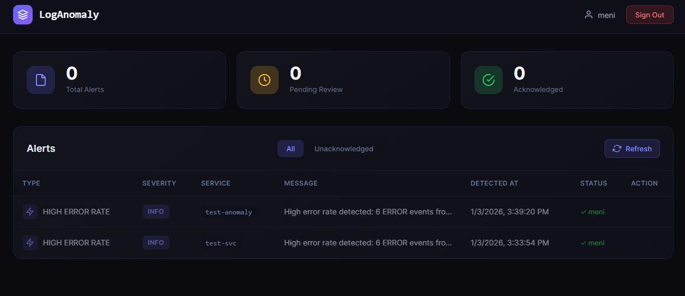
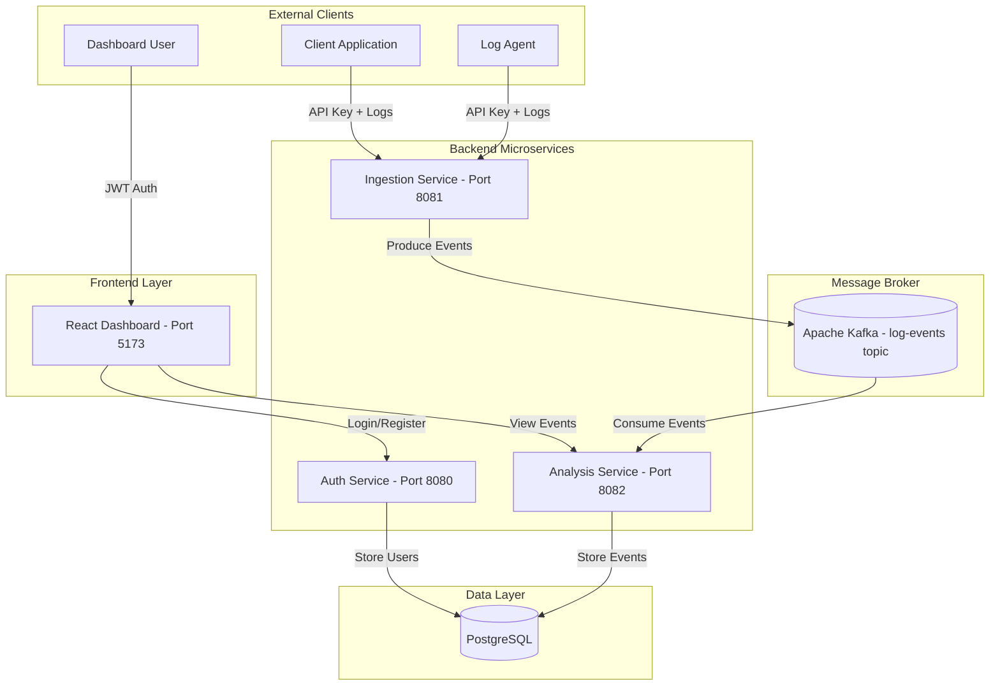
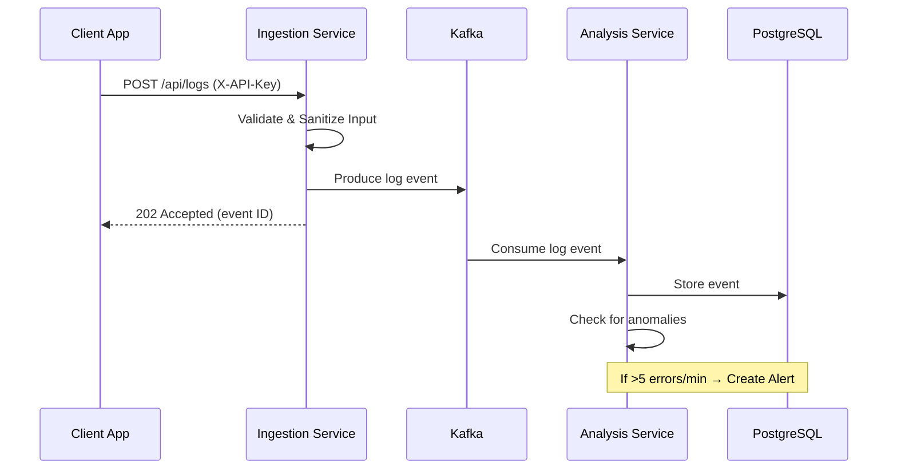
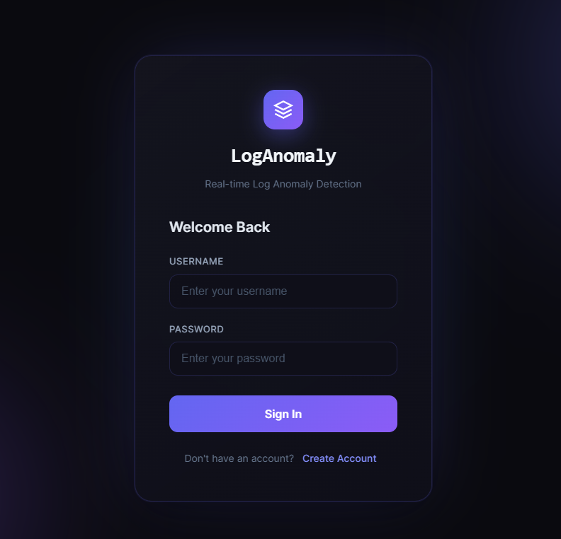

# LogAnomaly Detection Platform

Real-time log monitoring and anomaly detection platform built with Event-Driven Microservices.



## Tech Stack

| Layer | Technology |
|-------|------------|
| Backend | Java 17, Spring Boot 3, Gradle |
| Frontend | React, TypeScript, Vite |
| Database | PostgreSQL 14 |
| Messaging | Apache Kafka |
| Infrastructure | Docker, Docker Compose |

## Architecture



## Data Flow



## Services

| Service | Purpose | Port |
|---------|---------|------|
| auth-service | User registration, login, JWT | 8080 |
| ingestion-service | Receives logs, validates, sanitizes, publishes to Kafka | 8081 |
| analysis-service | Consumes from Kafka, stores in DB, anomaly detection | 8082 |
| frontend-ui | React dashboard | 5173 |
| postgres-db | PostgreSQL database | 5432 |
| kafka | Message broker | 9092 |

## Frontend UI

The React dashboard provides a modern, real-time interface for monitoring log anomalies.

### Screenshots

| Login Page | Dashboard |
|------------|-----------|
|  |  |

### Features

| Feature | Description |
|---------|-------------|
| 🔐 **Authentication** | Login/Register with JWT tokens |
| 📊 **Stats Cards** | Total, Pending, Acknowledged alerts at a glance |
| 🔍 **Filtering** | Toggle between All / Unacknowledged alerts |
| ✅ **Acknowledge** | Mark alerts as reviewed with one click |
| 🔄 **Auto-Refresh** | Dashboard updates every 10 seconds |
| 🎨 **Dark Theme** | Modern dark UI with severity color coding |

### UI Components

**Dashboard Layout:**
```
┌──────────────────────────────────────────────────────────────────────────┐
│  ◇ LogAnomaly                                      👤 meni  [Sign Out]   │
├──────────────────────────────────────────────────────────────────────────┤
│                                                                          │
│  ┌────────────────────┐  ┌────────────────────┐  ┌────────────────────┐  │
│  │  📄  0             │  │  ⏱️  0             │  │  ✅  0             │  │
│  │     Total Alerts   │  │     Pending Review │  │     Acknowledged   │  │
│  └────────────────────┘  └────────────────────┘  └────────────────────┘  │
│                                                                          │
│  Alerts                          [All] [Unacknowledged]      🔄 Refresh  │
│  ┌──────────────────────────────────────────────────────────────────────┐│
│  │ TYPE          │ SEVERITY │ SERVICE      │ MESSAGE          │ STATUS ││
│  ├───────────────┼──────────┼──────────────┼──────────────────┼────────┤│
│  │ ⚡ HIGH ERROR │ INFO     │ test-anomaly │ 6 ERROR events...│ ✓ meni ││
│  │ ⚡ HIGH ERROR │ INFO     │ test-svc     │ 6 ERROR events...│ ✓ meni ││
│  └──────────────────────────────────────────────────────────────────────┘│
└──────────────────────────────────────────────────────────────────────────┘
```

**Login Page:**
```
        ┌─────────────────────────────────────┐
        │              ◇                      │
        │          LogAnomaly                 │
        │   Real-time Log Anomaly Detection   │
        │                                     │
        │         Welcome Back                │
        │                                     │
        │  USERNAME                           │
        │  ┌─────────────────────────────┐   │
        │  │ Enter your username         │   │
        │  └─────────────────────────────┘   │
        │                                     │
        │  PASSWORD                           │
        │  ┌─────────────────────────────┐   │
        │  │ Enter your password         │   │
        │  └─────────────────────────────┘   │
        │                                     │
        │  ┌─────────────────────────────┐   │
        │  │          Sign In            │   │
        │  └─────────────────────────────┘   │
        │                                     │
        │  Don't have an account?             │
        │            Create Account           │
        └─────────────────────────────────────┘
```

### Severity Colors

| Severity | Color | Meaning |
|----------|-------|---------|
| `CRITICAL` | 🔴 Red | Immediate attention required |
| `WARNING` | 🟡 Yellow | Potential issue |
| `INFO` | 🔵 Blue | Informational |

## Quick Start

```bash
# Start everything
docker-compose up --build -d

# View logs
docker-compose logs -f

# Stop and clean
docker-compose down -v
```

## API Usage

### Send Logs (Ingestion Service)

```bash
# Single log
curl -X POST http://localhost:8081/api/logs \
  -H "Content-Type: application/json" \
  -H "X-API-Key: your-api-key-here-change-in-production" \
  -d '{
    "level": "INFO",
    "message": "User login successful",
    "service": "auth-service",
    "metadata": {"userId": "123"}
  }'

# Batch logs
curl -X POST http://localhost:8081/api/logs/batch \
  -H "Content-Type: application/json" \
  -H "X-API-Key: your-api-key-here-change-in-production" \
  -d '{
    "logs": [
      {"level": "INFO", "message": "Request processed", "service": "api-gateway"},
      {"level": "ERROR", "message": "Connection failed", "service": "db-service"}
    ]
  }'
```

### Query Events (Analysis Service)

```bash
# Get recent events
curl http://localhost:8082/api/events

# Get event count
curl http://localhost:8082/api/events/count

# Filter by service
curl http://localhost:8082/api/events/service/auth-service

# Filter by level
curl http://localhost:8082/api/events/level/ERROR
```

### Alerts API (Anomaly Detection)

```bash
# Get all alerts
curl http://localhost:8082/api/alerts

# Get unacknowledged alerts
curl http://localhost:8082/api/alerts/unacknowledged

# Get alert statistics
curl http://localhost:8082/api/alerts/stats

# Acknowledge an alert
curl -X PATCH "http://localhost:8082/api/alerts/{id}/acknowledge?acknowledgedBy=admin"
```

### Authentication (Auth Service)

```bash
# Register
curl -X POST http://localhost:8080/register \
  -H "Content-Type: application/json" \
  -d '{"username": "user1", "email": "user1@example.com", "password": "password123"}'

# Login
curl -X POST http://localhost:8080/login \
  -H "Content-Type: application/json" \
  -d '{"username": "user1", "password": "password123"}'
```

## Log Event Schema

| Field | Type | Required | Description |
|-------|------|----------|-------------|
| level | String | Yes | TRACE, DEBUG, INFO, WARN, ERROR, FATAL |
| message | String | Yes | Log message (max 64KB) |
| service | String | Yes | Source service name (max 100 chars) |
| timestamp | ISO-8601 | No | Auto-generated if not provided |
| metadata | Object | No | Additional key-value pairs |

## Security Features

- **Input Validation**: All log fields are validated with Jakarta Bean Validation
- **Input Sanitization**: Log messages are sanitized to remove:
  - `<script>` tags (XSS prevention)
  - SQL injection patterns (`DROP`, `DELETE`, etc.)
  - Control characters
- **API Key Authentication**: Machine-to-machine auth for log ingestion
- **JWT Authentication**: User authentication for dashboard access
- **Secrets Externalization**: All credentials stored in environment variables

## Local Development

```bash
# Start infrastructure only
docker-compose up -d postgres-db zookeeper kafka

# Build all services
./gradlew build

# Run individual services
./gradlew :auth-service:bootRun
./gradlew :ingestion-service:bootRun
./gradlew :analysis-service:bootRun

# Run frontend
cd frontend-ui && npm install && npm run dev
```

### Frontend Development

```bash
cd frontend-ui

# Install dependencies
npm install

# Start dev server (hot reload)
npm run dev

# Build for production
npm run build

# Preview production build
npm run preview
```

**Frontend Architecture:**

```
frontend-ui/src/
├── main.tsx              # Entry point
├── App.tsx               # Router + AuthProvider wrapper
├── types/index.ts        # TypeScript interfaces
├── context/
│   └── AuthContext.tsx   # Global auth state (login/logout/token)
├── api/
│   ├── config.ts         # Backend URLs
│   ├── auth.ts           # Login/Register API calls
│   └── alerts.ts         # Alerts API calls
├── components/
│   └── ProtectedRoute.tsx # Route guard (redirects if not logged in)
└── pages/
    ├── Login.tsx         # Login/Register form
    └── Dashboard.tsx     # Alerts table with stats
```

## Testing

```bash
# Run all tests
./gradlew test

# Test specific service
./gradlew :ingestion-service:test
./gradlew :analysis-service:test
./gradlew :auth-service:test
```

## Project Structure

```
loganomaly/
├── auth-service/          # JWT authentication
├── ingestion-service/     # Log ingestion (Kafka producer)
├── analysis-service/      # Event processing (Kafka consumer)
├── frontend-ui/           # React dashboard
├── common/                # Shared DTOs
├── docker-compose.yml
└── test-pipeline.http     # API test file
```

## Configuration

### Environment Variables (Secrets)

All secrets are externalized to environment variables with fallback defaults:

| Variable | Service | Default |
|----------|---------|---------|
| `INGESTION_API_KEY` | ingestion-service | `your-api-key-here-change-in-production` |
| `JWT_SECRET` | auth-service | 32-char secret key |
| `DB_USER` | auth/analysis | `user` |
| `DB_PASSWORD` | auth/analysis | `password` |

**Production**: Set these in your environment before running:

```bash
export INGESTION_API_KEY="my-secure-api-key"
export JWT_SECRET="my-256-bit-secret-key-at-least-32-chars"
export DB_USER="prod_user"
export DB_PASSWORD="strong_password"
docker-compose up --build -d
```

### Anomaly Detection Settings

| Variable | Default | Description |
|----------|---------|-------------|
| `ANOMALY_ERROR_THRESHOLD` | 5 | Errors to trigger alert |
| `ANOMALY_TIME_WINDOW_MINUTES` | 1 | Time window for counting |
| `ANOMALY_COOLDOWN_MINUTES` | 5 | Cooldown between alerts |

### Service Configuration

| Config | Location | Key Settings |
|--------|----------|--------------|
| API Key | ingestion-service/application.properties | `ingestion.api-key` |
| JWT Secret | auth-service/application.properties | `jwt.secret` |
| Database | */application.properties | `spring.datasource.*` |
| Kafka | */application.properties | `spring.kafka.bootstrap-servers` |

## Troubleshooting

```bash
# Check running containers
docker ps

# View service logs
docker-compose logs -f ingestion-service
docker-compose logs -f analysis-service

# Restart a service
docker-compose restart analysis-service

# Reset database
docker-compose down -v
docker-compose up --build -d
```

## Adding Screenshots

To add screenshots to this README:

1. Take screenshots of the Login and Dashboard pages
2. Save them to the `docs/` folder:
   - `docs/dashboard-preview.png` - Main dashboard view (wide)
   - `docs/login.png` - Login page
   - `docs/dashboard.png` - Dashboard with alerts
3. Commit the images to your repository

**Quick screenshot tips:**
- Use browser DevTools (F12) → Device toolbar for consistent sizing
- Recommended width: 1280px for dashboard, 800px for login
- Use dark mode for best results (matches the UI theme)
