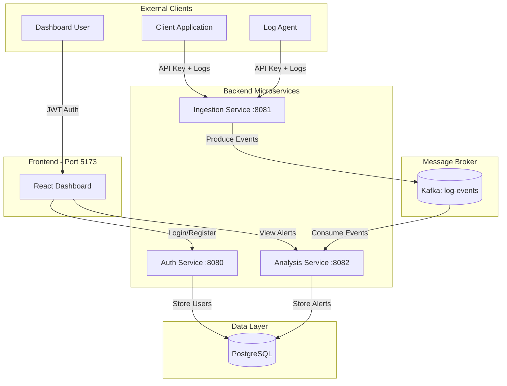
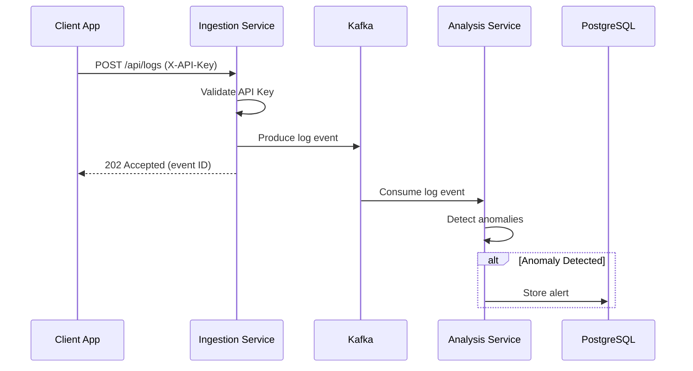

# LogAnomaly Detection Platform

## 🎯 Overview

This project is a platform for monitoring and detecting anomalies in logs in real-time. The system is built on an Event-Driven Microservices architecture using Spring Boot and utilizes Apache Kafka as the backbone for data streaming.

## ⚙️ Key Technologies

- **Backend**: Java 17, Spring Boot 3, Gradle Multi-Module
- **Frontend**: React, TypeScript, Vite
- **Database**: PostgreSQL 14 (for storing users and alerts)
- **Messaging**: Apache Kafka 7.3.0 (for log streaming)
- **Infrastructure**: Docker, Docker Compose
- **Security**: Spring Security, JWT (Auth Service)

## 🏗️ Architectural Structure

### System Architecture Diagram



### Data Flow



### Service Overview

| Module / Service | Role | Technology | Port |
|-----------------|------|------------|------|
| **auth-service** | Handles registration, login, and JWT issuance | Spring Security, JPA, PostgreSQL | 8080 |
| **ingestion-service** | Receives logs via REST API (API Key auth) and pushes them to Kafka | Spring Web, Spring Kafka, Spring Security | 8081 |
| **analysis-service** | Consumes logs from Kafka, executes anomaly detection logic, and persists alerts | Spring Kafka, JPA, PostgreSQL | 8082 |
| **frontend-ui** | React-based web interface for interacting with the platform | React, TypeScript, Vite | 5173 |
| **common** | Java library containing shared data models (DTOs) | Java | - |

### Infrastructure Services

| Service | Purpose | Port |
|---------|---------|------|
| **postgres-db** | PostgreSQL database for data persistence | 5432 |
| **kafka** | Apache Kafka message broker | 9092 |
| **zookeeper** | ZooKeeper for Kafka coordination | 2181 |

## 🚀 Quick Start

### Prerequisites

- **Java 17 JDK** (for local development)
- **Docker & Docker Compose** (for running the entire stack)
- **Node.js 18+** (for frontend development, if running locally)
- **Gradle** (comes with the wrapper - `gradlew`)

### Option 1: Run Everything with Docker Compose (Recommended)

The easiest way to get started is to run the entire stack using Docker Compose:

```bash
# Build and start all services
docker-compose up --build -d

# View logs
docker-compose logs -f

# Stop all services
docker-compose down

# Stop and remove volumes (clean slate)
docker-compose down -v
```

This will:
- Start PostgreSQL database
- Start ZooKeeper and Kafka
- Build and start all backend services (auth, ingestion, analysis)
- Start the frontend development server

### Option 2: Local Development Setup

#### 1. Start Infrastructure Services

Start only the infrastructure services (database and Kafka):

```bash
docker-compose up -d postgres-db zookeeper kafka
```

#### 2. Build Backend Services

Since the project is a Multi-Module build, build all modules using the Gradle wrapper:

```bash
# Build all modules (skip tests for faster build)
./gradlew clean build -x test

# Or build with tests
./gradlew clean build

# Build specific service
./gradlew :auth-service:build
./gradlew :ingestion-service:build
./gradlew :analysis-service:build
```

#### 3. Run Backend Services Locally

Each service can be run individually using Gradle:

```bash
# Run auth-service
cd auth-service
./gradlew bootRun

# Run ingestion-service (in another terminal)
cd ingestion-service
./gradlew bootRun

# Run analysis-service (in another terminal)
cd analysis-service
./gradlew bootRun
```

#### 4. Run Frontend Locally

```bash
cd frontend-ui
npm install
npm run dev
```

## 🔧 Configuration

### Database Configuration

Both `auth-service` and `analysis-service` are configured to use PostgreSQL:

- **Host**: `postgres-db` (in Docker) or `localhost` (local)
- **Port**: `5432`
- **Database**: `log_db`
- **Username**: `user`
- **Password**: `password`

### Kafka Configuration

- **Bootstrap Servers**: `kafka:29092` (in Docker) or `localhost:9092` (local)
- **Topic**: `log-events`
- **Consumer Group**: `analysis-service-group`

### JWT Configuration (Auth Service)

Configure JWT settings in `auth-service/src/main/resources/application.properties`:

```properties
# JWT Configuration
jwt.secret=your-secret-key-min-32-chars-for-hs256-algorithm
jwt.expiration=3600000  # 1 hour in milliseconds
```

**Important**: Change `jwt.secret` to a secure random string in production (minimum 32 characters for HS256).

### API Key Configuration (Ingestion Service)

Configure the API key in `ingestion-service/src/main/resources/application.properties`:

```properties
# API Key for log ingestion (machine-to-machine auth)
ingestion.api-key=your-api-key-here-change-in-production
```

**Important**: Change the API key to a secure random string in production. Consider using environment variables:

```bash
# Set via environment variable
export INGESTION_API_KEY=your-secure-api-key
```

### Service Configuration Files

- `auth-service/src/main/resources/application.properties` - Auth service config with DB and JWT settings
- `ingestion-service/src/main/resources/application.properties` - Ingestion service config with Kafka and API key
- `analysis-service/src/main/resources/application.properties` - Analysis service config with DB and Kafka settings

## 🔑 API Usage

### Step 1: User Registration/Login (Auth Service)

Register a new user or login to receive a JWT token:

```bash
# Register (POST /register)
curl -X POST http://localhost:8080/register \
  -H "Content-Type: application/json" \
  -d '{
    "username": "user1",
    "email": "user1@example.com",
    "password": "password123"
  }'

# Response (200 OK):
{
  "token": "eyJhbGciOiJIUzI1NiIsInR5cCI6IkpXVCJ9...",
  "username": "user1",
  "email": "user1@example.com"
}

# Login (POST /login)
curl -X POST http://localhost:8080/login \
  -H "Content-Type: application/json" \
  -d '{
    "username": "user1",
    "password": "password123"
  }'

# Response (200 OK):
{
  "token": "eyJhbGciOiJIUzI1NiIsInR5cCI6IkpXVCJ9...",
  "username": "user1",
  "email": "user1@example.com"
}

# Health Check (GET /health)
curl http://localhost:8080/health

# Response:
{
  "status": "UP",
  "service": "auth-service"
}
```

**Error Responses**:
- `409 Conflict`: Username or email already exists
- `401 Unauthorized`: Invalid credentials during login

### Step 2: Sending Logs (Ingestion Service)

The ingestion service uses **API Key authentication** (not JWT) for machine-to-machine log ingestion.

#### Single Log Ingestion

```bash
curl -X POST http://localhost:8081/api/logs \
  -H "Content-Type: application/json" \
  -H "X-API-Key: your-api-key-here-change-in-production" \
  -d '{
    "timestamp": "2025-12-19T10:00:00Z",
    "level": "INFO",
    "message": "User login successful for user_id: 101",
    "service": "auth-service",
    "metadata": {
      "user_id": "101",
      "ip_address": "192.168.1.100"
    }
  }'

# Response (202 Accepted):
{
  "id": "550e8400-e29b-41d4-a716-446655440000",
  "status": "ACCEPTED",
  "timestamp": "2025-12-19T10:00:01Z"
}
```

#### Batch Log Ingestion

For high-volume clients, use the batch endpoint:

```bash
curl -X POST http://localhost:8081/api/logs/batch \
  -H "Content-Type: application/json" \
  -H "X-API-Key: your-api-key-here-change-in-production" \
  -d '{
    "logs": [
      {
        "level": "INFO",
        "message": "Request processed",
        "service": "api-gateway"
      },
      {
        "level": "ERROR",
        "message": "Database connection failed",
        "service": "user-service"
      },
      {
        "level": "WARN",
        "message": "High memory usage detected",
        "service": "cache-service"
      }
    ]
  }'

# Response (202 Accepted):
{
  "acceptedCount": 3,
  "failedCount": 0,
  "acceptedIds": ["id-1", "id-2", "id-3"],
  "timestamp": "2025-12-19T10:00:01Z"
}
```

#### Health Check

```bash
curl http://localhost:8081/health

# Response:
{
  "status": "UP",
  "service": "ingestion-service"
}
```

**Log Event Fields**:
| Field | Type | Required | Description |
|-------|------|----------|-------------|
| `timestamp` | ISO-8601 | No | Event timestamp (auto-generated if not provided) |
| `level` | String | Yes | Log level (TRACE, DEBUG, INFO, WARN, ERROR, FATAL) |
| `message` | String | Yes | Log message content |
| `service` | String | Yes | Source service name |
| `metadata` | Object | No | Additional key-value pairs |

**Note**: Anomaly examples might include:
- Logs containing "SECURITY_BREACH"
- High volume of ERROR or CRITICAL level logs
- Unusual patterns detected by the analysis service

### Step 3: Checking Alerts (Analysis Service)

Retrieve the list of detected anomalies:

```bash
# Get all alerts
curl -X GET http://localhost:8082/api/alerts \
  -H "Authorization: Bearer YOUR_JWT_TOKEN"
```

## 🏗️ Project Structure

```
loganomaly/
├── auth-service/          # Authentication & authorization service
│   ├── src/main/java/     # Java source code
│   ├── src/main/resources/application.properties
│   └── Dockerfile
├── ingestion-service/     # Log ingestion service (Kafka producer)
│   ├── src/main/java/
│   ├── src/main/resources/application.properties
│   └── Dockerfile
├── analysis-service/      # Anomaly detection service (Kafka consumer)
│   ├── src/main/java/
│   ├── src/main/resources/application.properties
│   └── Dockerfile
├── frontend-ui/           # React frontend application
│   ├── src/
│   └── package.json
├── common/                # Shared Java library
│   └── src/main/java/
├── docker-compose.yml     # Docker Compose configuration
└── build.gradle           # Root Gradle build file
```

## 🐳 Docker Services

All services are containerized and can be managed via Docker Compose:

### Backend Services

- **auth-service**: Multi-stage Dockerfile (JDK for build, JRE for runtime)
- **ingestion-service**: Multi-stage Dockerfile
- **analysis-service**: Multi-stage Dockerfile with Kafka listener

### Frontend Service

- **frontend-ui**: Uses Node.js 18 Alpine, runs Vite dev server with hot reload

### Infrastructure

- **postgres-db**: PostgreSQL 14 Alpine with persistent volume
- **kafka**: Confluent Kafka 7.3.0
- **zookeeper**: Confluent ZooKeeper 7.3.0

## 🧪 Testing

Run tests for all services:

```bash
# Run all tests
./gradlew test

# Run tests for specific service
./gradlew :auth-service:test      # 28 comprehensive tests
./gradlew :ingestion-service:test # 21 comprehensive tests
./gradlew :analysis-service:test
```

### Auth Service Test Coverage (28 tests)

- **Unit Tests**: JwtService (10 tests), AuthenticationService (6 tests)
- **Controller Tests**: AuthController (6 tests) using MockMvc
- **Integration Tests**: SecurityConfiguration (5 tests)
- **Application Context**: Spring Boot application test (1 test)

### Ingestion Service Test Coverage (21 tests)

- **Controller Tests**: LogController (6 tests), HealthController (1 test)
- **Service Tests**: LogIngestionService (7 tests) - Kafka producer logic
- **Security Tests**: ApiKeyAuthentication (7 tests) - API key validation

All tests use mocked Kafka to avoid requiring a running Kafka instance.

**Note**: Tests are configured to exclude Kafka auto-configuration for fast execution without external dependencies.

## 🛡️ Security & DevSecOps

The project is designed with security best practices:

### Authentication & Authorization
- **JWT-based Authentication**: Stateless token-based authentication using JJWT 0.12.3 (Auth Service, for users)
- **API Key Authentication**: Simple header-based auth for machine-to-machine communication (Ingestion Service)
- **BCrypt Password Hashing**: Secure password storage with salt
- **Spring Security**: Configured with stateless session management
- **Public Endpoints**: `/register`, `/login`, `/health` are publicly accessible
- **Token Validation**: All protected endpoints validate JWT tokens or API keys

### Application Security
- **Separation of Concerns**: Clear separation between authentication, ingestion, and analysis services
- **CORS Configuration**: Cross-origin requests properly configured
- **Error Handling**: Centralized exception handling with appropriate HTTP status codes
- **Input Validation**: JPA validation constraints on user entities

### Infrastructure Security
- **Container Security**: Multi-stage Docker builds for minimal attack surface
- **Dependency Management**: Gradle dependency management with version control
- **Least Privilege**: Separate database users per service (in production)

### Best Practices
- **No Hardcoded Secrets**: JWT secret and API keys configured via properties files
- **Comprehensive Testing**: 49+ tests covering security configuration and authentication flows
- **Type-safe DTOs**: Request/response validation with Lombok-generated classes

## 📝 Development Notes

- **Kafka Listener**: The `analysis-service` includes a Kafka listener (`LogEventListener`) that automatically consumes messages from the `log-events` topic
- **Database Migrations**: JPA Hibernate auto-update is enabled for development (`spring.jpa.hibernate.ddl-auto=update`)
- **Service Discovery**: Services communicate using Docker service names (e.g., `postgres-db`, `kafka`)

## 🔍 Troubleshooting

### Services won't start
- Check Docker is running: `docker ps`
- Check logs: `docker-compose logs [service-name]`
- Ensure ports aren't in use: `netstat -an | grep 8080`

### Kafka connection issues
- Verify Kafka is running: `docker-compose ps kafka`
- Check Kafka logs: `docker-compose logs kafka`
- Ensure ZooKeeper is running before Kafka

### Database connection issues
- Verify PostgreSQL is running: `docker-compose ps postgres-db`
- Check database logs: `docker-compose logs postgres-db`
- Verify connection string in `application.properties`


